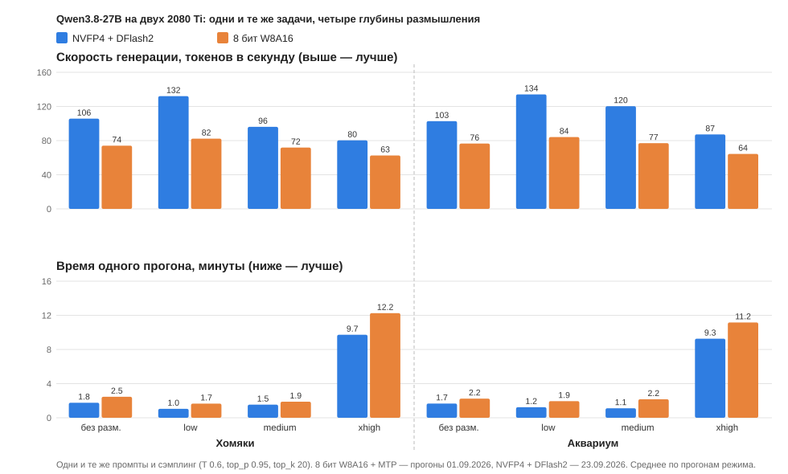

# 2×2080Ti + NVLink (44 GB)

🇬🇧 **English** | 🇷🇺 [Русский](README.md) · [❤️ Support the project](#support-the-project)

How to make large models run on two RTX 2080 Ti modded to 22 GB.

> ### 🖥️ [Open the site with the measurements and scenes →](https://tirex999.github.io/2x2080ti-nvlink-44gb/)
>
> Everything below is the same material as source files. The site reads better: real tables instead of a picket
> fence of pipes, and **the scenes from the tests open and run right in the browser**. The site and the detailed
> documents in [`docs/`](docs/) are in Russian.
>
> - [**Which models work and which do not**](https://tirex999.github.io/2x2080ti-nvlink-44gb/models.html) — with measurements and the reasons for failure
> - [**Hamsters: how different models coped**](https://tirex999.github.io/2x2080ti-nvlink-44gb/hamsters/) — every scene opens, the model's reasoning lies next to it
> - [Bought the cards — what next](https://tirex999.github.io/2x2080ti-nvlink-44gb/start-here.html) · [Measurements](https://tirex999.github.io/2x2080ti-nvlink-44gb/results.html) · [Pitfalls](https://tirex999.github.io/2x2080ti-nvlink-44gb/pitfalls.html) · [Forks](https://tirex999.github.io/2x2080ti-nvlink-44gb/forks.html)

Only what was **measured on a live rig** goes here, with the method and the dates — not a retelling of advice from
the internet. Where a conclusion turned out wrong, that is said plainly, together with what disproved it.

---

## Start here

**Just bought the cards and do not know where to begin** —
[`docs/start-here.md`](docs/start-here.md): system, driver, engine, model, launch. Five steps, each checked on a clean
machine.

**Do not want to build anything** — there is a ready-made build; no compiler and no CUDA toolkit needed:

```bash
curl -LO https://raw.githubusercontent.com/tirex999/2x2080ti-nvlink-44gb/main/scripts/install.sh
bash install.sh --check     # first just check the machine
bash install.sh             # install
```

The script checks the system, kernel, GCC, glibc, CUDA, the driver and the cards' architecture, and if something is
off it says exactly what and what to do instead. The wheels themselves are in the
[release](https://github.com/tirex999/2x2080ti-nvlink-44gb/releases/tag/vllm-0.2.1rc3-sm75-cu130).

The ready-made build runs on **Ubuntu 24.04 and newer**. It will not run on 22.04 for two reasons at once — Python
3.10 against cp312, and glibc 2.35 against 2.38; there you have to build the `0.1.x` branch yourself, and that is
described too.

---

## In short: what to download for your task

| I want | take | engine | speed |
|---|---|---|---:|
| **top speed on Qwen3.8** | [`unsloth/Qwen3.8-27B-NVFP4`](https://huggingface.co/unsloth/Qwen3.8-27B-NVFP4) · 22 GB + drafter [`z-lab/Qwen3.8-27B-DFlash2`](https://huggingface.co/z-lab/Qwen3.8-27B-DFlash2) (BF16!) | vLLM **0.2.1** + [two fixes](#qwen38-27b--dflash2-twice-as-fast-but-the-fork-needs-fixing) | **124–128 t/s** on code, ~60 on prose¹ |
| **top speed** | [`QuantTrio/Qwen3.6-27B-AWQ`](https://huggingface.co/QuantTrio/Qwen3.6-27B-AWQ) · 20.4 GB | vLLM **0.2.1-pre3** | **99.6 t/s** on code, 87.0 on prose |
| **the smartest of the fast ones** | [`twolven/Qwen3.8-27B-abliterated-AWQ-MTP`](https://huggingface.co/twolven/Qwen3.8-27B-abliterated-AWQ-MTP) · 18.2 GB | vLLM **0.2.1-pre3** | **99.4** on code, 74.8 on prose |
| **the smartest overall** | [`tirex2001/Qwen3.8-Flash-Next-DACAN`](https://huggingface.co/tirex2001/Qwen3.8-Flash-Next-DACAN) (NVFP4 + Q8 (DACAN)) | our own [DACAN](#our-own-engine-dacan--three-times-faster) | **72–80 t/s** on code, 60 on prose (47 in Russian), prompt 715–786 t/s, context 262144 |
| the same without our engine | [`lmstudio-community/Qwen3.8-Flash-Next-GGUF`](https://huggingface.co/lmstudio-community/Qwen3.8-Flash-Next-GGUF) Q4_K_M · 111 GB | llama.cpp | 17.7 t/s (28–30 with PR #27861), context 262144 |
| the same, more accurate | [`unsloth/Qwen3.8-Flash-Next-GGUF`](https://huggingface.co/unsloth/Qwen3.8-Flash-Next-GGUF) UD-Q6_K_XL · 158 GB | llama.cpp | 14.5 t/s, needs 160 GB of RAM |

¹ A different method from the neighbouring rows: live requests with the default reasoning, speed = answer tokens /
request time. A direct comparison with MTP on the same model is in the DFlash2 section below.

The engine for 27B is **vLLM only**: on llama.cpp the same model gives 30 t/s instead of 79.7. And vLLM does not run
Flash-Next at all — it does not know its architecture; we run it on our own engine **DACAN**, with llama.cpp as the
fallback.

> The numbers were taken on an **idle** server at `reasoning_effort=low`. Both caveats matter: on a busy server with
> `MAX_NUM_SEQS=1` the measurement measures the queue (44 instead of 61 for us), and at `xhigh` the model produces
> unpredictable reasoning, where the MTP draft guesses worse, and the speed drops. Details in
> [`docs/results.md`](docs/results.md), sections 8–10.

**The numbers in the table are averages over a long answer, not the ceiling.** The instantaneous speed on the same
rig ranges from 45 to **119.7 t/s**, and it follows an exact formula: `speed = accepted draft length × passes per
second`. The second factor is a hardware constant, **23.3 passes per second**; the first ranges from 1.9 to 4.9
depending on how predictable the text is. The identity holds within 1 % in 122 of 126 measurement windows. Details in
[`docs/results.md`](docs/results.md), section 6.

### Where 90+ comes from: the ENGINE BRANCH decides, not the quant

This is the main conclusion of the whole work, and it cost a day of trial and error.

For half a year the gap between Qwen3.6 (92.4 on code) and Qwen3.8 (79.7) was blamed on the quant. Three hypotheses
were checked by direct measurements and **all rejected**: the weight format, the quantization recipe, the build
version within the `0.1.x` branch. The cause turned out to be architectural — part of Qwen3.8's layers are SSM/Gated
Delta Net, and because of them the engine inflated the attention block to 816 tokens, calling prefix-cache support
for Mamba experimental.

The **`0.2.x`** branch brought kernels for exactly these layers — FlashQLA for SM70/SM75 with the symbols
`gdn_forward` and `gdn_forward_varlen`. The result on one model, one machine, one script and a **mirrored profile**
(only the engine version changed):

| model | `0.1.14` | `0.2.1-pre3` | gain on code |
|---|---|---|---:|
| Qwen3.6 | 80.1 / **92.4** / 80.9 | 87.0 / **99.6** / 88.0 | +7.8% |
| Qwen3.8 | 64.2 / **79.7** / 73.8 | 70.1 / **89.2** / 71.5 | **+11.9%** |

The gain for 3.8 is twice as large because it has the GDN layers the kernels were written for, while for 3.6 the
gain comes from the engine in general. Card load rose from 85–89% to **90–96% on both**.

**What you need besides the model itself:**

- the fork [`weicj/vLLM-2080Ti-Definitive`](https://github.com/weicj/vLLM-2080Ti-Definitive), branch **`0.2.x`**,
  release `v0.2.1-pre3`;
- **GCC exactly 15, CUDA 13.0, kernel 7 or newer** — three conditions, not one; details below, check your machine
  with one command: `bash scripts/check-prereqs.sh`;
- CUDA 13.0, Torch 2.13, `TORCH_CUDA_ARCH_LIST=7.5`;
- the profile from [`vllm/`](vllm/): `GPU_UTIL=0.94`, `MTP_K=4`, TP=2, **do not compress** the KV;
  `MAX_NUM_SEQS=2` for measurements, and **`1`** for live chat: a batch above one together with MTP and the CUDA
  graph brings the server down, see [`docs/pitfalls.md`](docs/pitfalls.md).
- `DISABLE_LOG_STATS=0`, otherwise there will be neither speed lines in the log nor `/metrics`.

The ready-made profiles of the `0.2.x` branch are meant for `MODEL_VARIANT=nvfp4` — the format for Blackwell, and
they should not be used on Turing. We made our own, mirroring the working profile from `0.1.14`.

Three pitfalls of the build itself are in [`docs/pitfalls.md`](docs/pitfalls.md), the section on `0.2.x`. Without
them it does not build at all.

---

## ⚠️ Before building `0.2.x`: three requirements, not one

The arguments about "you need Ubuntu 26" miss the point, because it is not about Ubuntu itself. The fork checks the
host with three conditions, and they are **hard-coded in its own** `PROJECT_RELEASE.env`, not invented by us:

```
PRIMARY_CUDA_VERSION="13.0"
PRIMARY_GCC_MAJOR="15"
PRIMARY_MIN_KERNEL_MAJOR="7"
```

| requirement | how `build.sh` checks it | ours | Ubuntu 24.04 out of the box |
|---|---|---|---|
| **GCC exactly 15** | `[[ "$gcc_major" != "$PRIMARY_GCC_MAJOR" ]]` — **an exact comparison of the major version**, not "15 or above" | 15.2.0 | 14 at most |
| **CUDA 13.0** | major version from `nvcc --version` | 13.0 | installed separately, not from the distribution's repository |
| **kernel ≥ 7** | `uname -r`, major version | 7.0.14 | 6.8 |

Nobody talks about the third one, yet it cuts off just as hard as GCC.

Plus a fourth, not on the list: with **glibc 2.41 and newer** you need the patch
`toolchain-patches/cuda-13.0-glibc-2.41-rsqrt.patch`. In the fork's repository it is **broken** — you will have to
apply it by hand, details in [`docs/pitfalls.md`](docs/pitfalls.md).

The check can be bypassed with `ALLOW_HOST_MISMATCH=1`, and the build will go. But the fork's message is honest here:
this is a `non-target dry run`, that is, an unverified configuration. We did not measure it and cannot promise
anything about it.

### The driver has nothing to do with the Ubuntu version

This is the second place of confusion. **The NVIDIA kernel module lives on the host, not in the container.** Our rig:

```
host         Debian 13 (trixie),   driver 610.43.02, nvidia modules on the host
container    Ubuntu 26.04,         userspace only: libcuda.so.610.43.02
```

So the system inside the container does not affect the driver at all. It is installed with the `.run` installer from
NVIDIA's site on the system where the kernel runs — and there the distribution hardly matters either, `.run` builds
the module for the current kernel. If your hardware is bare metal, without containers, — the same: `.run`, not the
distribution's package.

### What to do if you have 22.04 or 24.04

**Take the `0.1.x` branch. It is not a fallback and not a substitute.** The numbers 80.1 / 92.4 / 80.9 that the table
in this README starts with were taken on it:

```
Ubuntu 22.04 LTS · GCC 11.4 · CUDA 12.8 · torch 2.11.0+cu128 · driver 590.48.01
```

The difference from `0.2.x` is **8–12 %**, not a multiple. If you see 16–20 t/s, the cause is almost certainly not the
branch and not the system version: see [section 6 in `docs/results.md`](docs/results.md) — it breaks down what the
speed is made of and why it drops.

### Check your machine with one command

```bash
bash scripts/check-prereqs.sh
```

The script changes nothing. It looks at the system, kernel, GCC, glibc, CUDA, the driver and the cards' architecture,
and then says plainly whether `0.2.x` builds on your machine or not, and if not, what exactly is in the way. Checked
on two machines: one where everything fits and one where it does not.


---

## The rig

| | |
|---|---|
| Cards | 2× RTX 2080 Ti, modded to 22 GB each = **44 GB**, NVLink NV2 (2×25.78 GB/s), Turing sm_75, both on PCIe 3.0 x16 |
| CPUs | 2× Intel Ice Lake-SP, 64 physical cores / 128 threads (32 cores per socket), AVX512 + VNNI, no AMX and no bf16 |
| Memory | 16 × 16 GB DDR4 RDIMM, running at 2666, all 16 channels (8 per socket), 256 GB (the OS sees 251 GiB) |
| Driver | 610.43.02, host Debian 13, kernel 7.0 |
| Models | DACAN — on the node's local volume; the rest — on NFS, 1 GbE |

The cards have been on this node since 08.09.2026. Before that they were on the neighbouring one: 2× Ice Lake-SP,
72 cores / 144 threads, 12 × 32 GB LRDIMM 2133 (12 channels), 384 GB — the numbers of the early measurements
(including the first rows of the memory tables below) were taken on it.

> **Where to get such cards.** 2× RTX 2080 Ti modded to 22 GB with an NVLink bridge —
> from [this rig owner's listing on Avito](https://www.avito.ru/sankt-peterburg/tovary_dlya_kompyutera/2hrtx_2080_ti_22gb_nvlink_44gb_dlya_llm_i_ai_8166072307).
> Questions about buying go there too.


---

## Qwen3.8-27B: every quant we tried

Method: greedy (`temperature 0`), 900 tokens, double warm-up, best of three, counted by `usage.completion_tokens`.
Profiles and units are in [`vllm/`](vllm/), a folder per quant.

| quant | size | engine | prose | code | repeat |
|---|---:|---|---:|---:|---:|
| [Qwen3.**6** AWQ (QuantTrio)](https://huggingface.co/QuantTrio/Qwen3.6-27B-AWQ) | 20.4 GB | vLLM **0.2.1-pre3** | 87.0 | **99.6** | 88.0 |
| [twolven AWQ-MTP](https://huggingface.co/twolven/Qwen3.8-27B-abliterated-AWQ-MTP) | 18.2 GB | vLLM **0.2.1-pre3** | 70.1 | **89.2** | 71.5 |
| Qwen3.6 AWQ, old branch | 20.4 GB | vLLM 0.1.14 | 80.1 | 92.4 | 80.9 |
| the same on vLLM 0.1.17 | 20.4 GB | vLLM 0.1.17 | 78.8 | 88.6 | 79.8 |
| twolven AWQ-MTP, old branch | 18.2 GB | vLLM 0.1.14 | 64.2 | 79.7 | 73.8 |
| [shawnw3i real AWQ, group 64](https://huggingface.co/shawnw3i/Qwen3.8-27B-AWQ-MTP) | 18.7 GB | vLLM 0.1.14 | 64.0 | 64.5 | 70.9 |
| our own GPTQ by the champion's recipe | 20 GB | vLLM 0.1.14 | 57.8 | 69.0 | 71.6 |
| [lued INT8 W8A16-MTP](https://huggingface.co/lued/Qwen3.8-27B-INT8-W8A16-MTP) | 29.5 GB | vLLM 0.1.14 | 47.5 | 55.1 | 50.9 |
| Q8_0 GGUF + MTP | 27 GB | llama.cpp | — | — | 30.2 |
| Q6_K_L GGUF + MTP | 23 GB | llama.cpp | — | — | 26.3 |

### What follows from this

**Eight bits on Turing cost 40% of the speed.** 55.1 against 79.7 for the 4-bit AWQ. The cause is not the quant but
the cards: on SM75 the INT8 path is not optimized — a separate measurement of Quark-INT8 W8A8 gave 15.7 against 113
for AWQ, seven times less.

**Real `awq` is not faster than `compressed-tensors`.** We took it specifically to check: 64.5 against 79.7. The
format by itself decides nothing.

**Our own quant by the champion's recipe did not catch up with the ready-made one** — 69.0 against 79.7. So the 3.6
vs 3.8 gap is not created by the quantization recipe.

**The gap is architectural.** Part of Qwen3.8's layers are SSM/Gated Delta Net, and because of them the engine writes
at start:

```
Prefix caching in Mamba cache 'align' mode is currently enabled.
Its support for Mamba layers is experimental.
Setting attention block size to 816 tokens to ensure that
attention page size is >= mamba page size
```

Qwen3.6 has no such layers. No quant will remove this — you need kernels for GDN, and they are in the `0.2.x` branch of
the same fork.

---

## Qwen3.8-27B + DFlash2: twice as fast, but the fork needs fixing

DFlash2 is speculative decoding with a block draft: a small drafter (3.6 GB) proposes 7 tokens at once, the main model
checks them in one pass. The fork `weicj/vLLM-2080Ti-Definitive` v0.2.1 has a ready profile for it for a pair of
2080 Ti (`profiles/2x2080Ti/qwen27b/w4a16/dflash2-fp8kv-1x256k-text-image.env`).

One model (NVFP4), the same four requests, one launcher, `temperature 0`:

| | average | code | task with a solution | prose |
|---|---:|---:|---:|---:|
| no drafter | 37 | 37 | 37 | 37 |
| MTP K=4 (the fork author's profile) | 60 | 74 | 70–72 | 57 |
| **DFlash2** | **74–78** | **124–128** | **107–112** | ~60 |

The more predictable the text, the bigger the gain: on code the drafter guesses 4–5 tokens out of 7 per step, on free
prose about two.

**And on 8 bits?** `lued/Qwen3.8-27B-INT8-W8A16-MTP` with the same drafter and the same fixes works: 28 → 48 t/s on
average (code 77, task 60, prose 33, at `temperature 1` — 40). A ×1.7 speed-up, but in absolute terms it is the level
of the same model with its own MTP (72–84 t/s on the hamster scenes, a different set of requests): a pass over 8-bit
weights is more expensive, and the draft pays off worse. Keeping 8 bits for the sake of DFlash2 makes no sense —
NVFP4 + DFlash2 is 1.5–1.6 times faster.

**The 220 t/s from the fork's README is not the speed on text.** The launcher's built-in benchmark feeds a one-word
prompt ` the` and lets the model answer only with it; the drafter guesses everything, and the benchmark shows the
hardware ceiling. Here the same test gives 198 (221 for the author).

**Without fixes the recipe spoils the text.** Three pitfalls, all checked by measurement:

1. **A drafter in FP16 runs idle.** `deepsweet/...-DFlash2-FP16` is a conversion for Apple; the Turing codec turns on
   only with BF16. You need the original `z-lab` (also `incoai`, byte-for-byte the same file). The log must contain
   the line `Enabled native DFlash2 BF16 transport for SM75`.
2. **The drafts on the two cards diverge.** The drafter on each card computes on its own, in fp16 the variants drift
   apart, and the main model receives a mix of two texts (garbled words in Russian output). On NVFP4 — on 249 steps out
   of 256 **even at `temperature 0`**. Fix: hand out the drafts from card 0 —
   [`scripts/dflash2-draft-broadcast.patch`](scripts/dflash2-draft-broadcast.patch), 8 lines, does not change the
   speed.
3. **The launcher throws away the model's `top_k`/`top_p`** (`--generation-config vllm`). At `temperature > 0` the
   model pulls words from the whole vocabulary and cuts the answer off mid-word. Fix:
   [`scripts/launcher-generation-config.patch`](scripts/launcher-generation-config.patch).

How we checked that the text is not spoiled: every answer token is compared with the same model without the drafter —
[`scripts/eq_gen.py`](scripts/eq_gen.py) and [`scripts/eq_score.py`](scripts/eq_score.py). The full analysis with the
method — [`docs/results.md`](docs/results.md), section 14.

**Quality on the reference scenes.** Hamsters and aquarium, four reasoning depths, two runs each: the scenes are no
worse than with 8-bit W8A16, generation is 1.3–1.6 times faster, xhigh takes 9–10 minutes instead of 11–12. Without
reasoning both models fail the scenes more often. Tables and image-based scores — [`docs/results.md`](docs/results.md),
section 15, the scenes themselves — in the [gallery](https://tirex999.github.io/2x2080ti-nvlink-44gb/hamsters/).



**Connecting an agent and keeping reasoning at xhigh.** The server exposes a regular OpenAI-compatible API, so an
agent connects like any custom provider. One pitfall: agents pass the reasoning depth each in their own way (Hermes,
for example, puts it in `extra_body.reasoning`), and vLLM silently ignores such a field — the Qwen3.8 template sees it
only through `chat_template_kwargs`. If you do not pin it, the server default applies, and different agents end up
with different depths. The provider entry in `~/.hermes/config.yaml`:

```yaml
providers:
  stend-dflash2:
    name: vLLM 2x2080Ti (NVFP4 + DFlash2)
    api: http://<server-address>:8000/v1
    api_mode: openai
    api_key: local
    default_model: qwen38dflash2
    context_length: 253952
    request_timeout_seconds: 1800   # an xhigh answer takes 5–10 minutes
    models:
      - id: qwen38dflash2
        context_length: 253952
    extra_body:
      chat_template_kwargs:
        reasoning_effort: xhigh      # the template accepts only low / medium / xhigh
```

Hermes mixes the provider's `extra_body` into every request, crons included
(`hermes cron edit <id> --model qwen38dflash2 --provider stend-dflash2`). The fork's profile keeps **one** generation
stream: requests from agents, crons and chat queue up one after another, and one xhigh job occupies the server for
several minutes.

---

## Qwen3.8-Flash-Next: 177 B that do not fit in the cards

512 experts, 10 work per token. The model is 110.9 GB in Q4_K_M — the experts live in RAM, the rest on the cards.

| configuration | prompt | generation |
|---|---:|---:|
| baseline: `-cmoe`, all 144 threads | 10.5 | 15.4 |
| `-t 32 -tb 144` | 10.5 | 16.0 |
| `-ncmoe 42`, context 32768 | 12.0 | 16.1 |
| **`-ot`: 12 expert layers across both cards** | **12.6** | **17.7** |
| the same + context 262144 with KV in `q8_0` | 12.5 | 18.0 |
| CPU only, no cards | — | 6.65 |

The working launch — [`llamacpp/qwen38-flash-next/run.sh`](llamacpp/qwen38-flash-next/run.sh). You need llama.cpp no
older than commit `c841aee` (that is where `qwen4exp` support was merged).

**The full context is almost free:** 262144 with compressed KV costs 0.1 t/s on the prompt and 0.3 on generation
compared with 32768.

**The MTP head** is separate: [`dzannotti/Qwen3.8-Flash-Next-MTP-GGUF`](https://huggingface.co/dzannotti/Qwen3.8-Flash-Next-MTP-GGUF),
2.5 GB. The author advises taking Q4_K_M rather than Q8_0 — a draft quantized like the target agrees with it more
often. You need a build with the MTP kernel: commit `b98aa9847` in ggml-org.

**vLLM will not run this model.** Not because of memory: the `qwen4_exp` architecture is neither upstream (PR #53896
is open on v0.28.0) nor in the 2080Ti fork. It fails while parsing `config.json`, before memory is allocated, so
`--cpu-offload-gb` does not help. ktransformers, which can do "hot experts on the GPU", has the same story — request
#2179 is open.

### Our own engine: DACAN — three times faster

The best we got on this model is our fork of Strata, [github.com/tirex999/DACAN](https://github.com/tirex999/DACAN)
(weights — [huggingface.co/tirex2001/Qwen3.8-Flash-Next-DACAN](https://huggingface.co/tirex2001/Qwen3.8-Flash-Next-DACAN),
the **NVFP4 + Q8 (DACAN)** mix: NVFP4 routed experts, the dense part and the n-gram table in Q8_0), built for one model
and this machine: two cards, two Ice Lake sockets with AVX-512 VNNI, MTP drafts.

| | |
|---|---:|
| decode: code, 10 250 tokens / a list after a fresh 19K prompt (03.10, idle node) | 76.9 / 80.4 t/s |
| decode: an answer with reasoning low, 1 984 tokens (calibration request, 03.10) | 71.9 t/s |
| decode: English / Russian prose (03.10) | 60.4 / 47.0 t/s |
| decode at 98K of context (03.10) | 69.9 t/s |
| decode, an answer of 46 thousand tokens (xhigh) | 56.6 t/s |
| context | 262 144, KV int8 |
| prompt read from scratch, 19K: 03.10 / 29.09 | 786 / 798 t/s |
| prompt read from scratch: synthetic 98K (03.10) / a live Claude Code conversation of 94K (29.09) | 715 / 770 t/s |
| the same before 29.09: prefill at 8K / 195K | 309 / 267 t/s |
| conversation cache: a continuation comes from the cache, other conversations are parked in RAM | 16 conversations, 16 GiB |
| answer | up to 100 000 tokens |
| needle in a haystack at 8K, 24K, 105K, 195K | found everywhere |
| gallery, runs counted (checked in a browser) | 17 of 24; without physics 17 of 18 |

The answer speed is decided by the MTP drafts: on code and lists the engine accepts 85–89 % of the drafts, on English
prose 57 %, on Russian 32 %. Hence the 47–80 t/s spread. The 03.10 measurements were taken on an idle node: the Baison
run in the neighbouring VM was stopped for the measurement. The same calibration request on 27.09 with the VM loaded
gave 64.9 t/s (68.3 with a CPU limit for the VM), on 03.10 — 71.9; part of the gain also came from engine changes
after 27.09.

That is 2.7–4.5 times faster than llama.cpp from the table above (17.7 t/s), depending on the text. How it was built,
measurements and pitfalls — [docs/flash-next.md](docs/flash-next.md) (sections 03.10, 28.09 and 29.09), the check
scripts — [scripts/quality/](scripts/quality/).

---

## Cards against memory

On one and the same model:

| | generation | factor |
|---|---:|---:|
| CPU only, memory 12 channels 2133 (former node) | 6.65 | 1.00 |
| CPU only, memory 16 channels 2666 (current node) | 9.6 | 1.44 |
| two 2080 Ti, llama.cpp | **17.7** | **2.66** |

The cards give more than three-times-faster RAM. (Our engine DACAN on the same cards and memory — 72–80 t/s on code
and 47–60 on prose, see above.)

### Memory bandwidth: three configurations

Our own [`scripts/membw.c`](scripts/membw.c), STREAM triad, arrays 4 GiB×3, best of three, threads pinned
(`OMP_PROC_BIND=spread OMP_PLACES=cores`).

| memory configuration | Triad, peak | read | efficiency vs theory |
|---|---:|---:|---:|
| 12 × 32 GB **LRDIMM 2133**, 12 channels (former node) | 84.7 | — | 48% |
| 16 × 16 GB **2666**, 16 channels (**current node**, 30.08; 03.10 — 268.9, peak 274 at 128 threads) | 268.2 | — | 80% |
| 16 × 32 GB **2933**, all channels (another machine) | **274** | **316.3** | — |

The current rig is the second row. The third is another machine measured earlier: against 2666 it gives only +2% in
bandwidth; its advantage is capacity (512 GB against 256), not speed. Against the former node on LRDIMM 2133 the
bandwidth is three times higher.

**What matters is not thread pinning but where the memory lies** (measured 03.10, current node, neighbouring VM off):

| layout | Triad, GB/s |
|---|---:|
| whole machine, pages on their own socket (first touch), 64 threads: pinned / not | 268.9 / 269.4 |
| one socket, its own memory | 133–135 |
| one socket, the other socket's memory (over UPI) | 70.8 |
| whole machine, `numactl --interleave=all` | 182 |
| both sockets, all memory on one node | 95 |

On a quiet machine thread pinning gives almost nothing. On 30.08, with other machines working on the node, without it
we got 221.3 instead of 268.2 (minus 22%): the scheduler moved threads away from their memory. Under load pinning is
worth it. Interleaving pages across nodes gives away a third of the bandwidth, and all memory on one node two thirds.
Details and all thread counts — [docs/results.md](docs/results.md), section 4.

**LRDIMM at 2133 is the worst thing you can install.** It is not only the number of channels: efficiency against the
theoretical limit is 48% against 80% for 2666. A twofold gap in efficiency is not explained by the number of channels;
the suspects are LRDIMM latency and the low frequency.

**Synthetic tests do not predict model output.** The bandwidth difference between the first two configurations is
3.17×, while on generation of a MoE model on the CPU alone (Ornith-1.5-35B-A3B, llama-bench, 30.08) it is 1.74× (11.95
against 20.82 t/s), and on prompt processing 1.00×. Filling the two empty channels on the current node on 08.09 raised
the bandwidth by 43%, and the Flash-Next speed by 7%; the analysis is in [docs/flash-next.md](docs/flash-next.md),
"About memory bandwidth".

---

## Files

The documents are in Russian.

| | |
|---|---|
| [`docs/start-here.md`](docs/start-here.md) | bought the cards — what next: system, driver, engine, model, launch |
| [`docs/models.md`](docs/models.md) | which models work and which do not — with measurements and the reasons for failure |
| [`docs/results.md`](docs/results.md) | the full analysis of the measurements (vLLM, llama.cpp, memory bandwidth, DFlash2, scene quality), with the method for every number |
| [`docs/flash-next.md`](docs/flash-next.md) | Qwen3.8-Flash-Next: FreeToken, llama.cpp, our engine DACAN — by day |
| [`docs/pitfalls.md`](docs/pitfalls.md) | pitfalls: `-ot`, systemd, mlock, tar, measurements |
| [`docs/forks.md`](docs/forks.md) | Turing forks we checked |
| [`vllm/`](vllm/) | six quants, each with a profile, a model binding and a unit |
| [`llamacpp/`](llamacpp/) | the working Flash-Next launch |
| [`scripts/`](scripts/) | build for sm_75, measuring both speeds, measuring memory bandwidth, text check for speculative decoding (`eq_gen.py`, `eq_score.py`), two fork fixes for DFlash2 |

---

## Support the project

Everything here — measurements, builds, quants, the engine — is made and published for free. If it helped you run a
model on your own hardware, you can say thanks with a donation.

| | address | QR |
|---|---|---|
| **YooMoney** (roubles: a YooMoney wallet or any bank card) | `4100119356331418` · [send](https://yoomoney.ru/to/4100119356331418) |  |
| **USDT** (TRC-20, Tron network) | `TBvoJHi7uyonSpvdH9Y6RAAXGWYVR2jeqw` |  |
| **Ethereum** (ETH and Ethereum-network tokens, ERC-20) | `0x66CA7c683fbaF030b2300c918A3751209eA30dEa` |  |

> ⚠️ **The network matters.** Send only Tron-network assets (USDT TRC-20, TRX) to the Tron address and only
> Ethereum-network assets to the Ethereum address. Anything sent over the wrong network is lost.

Thank you! 🙏
